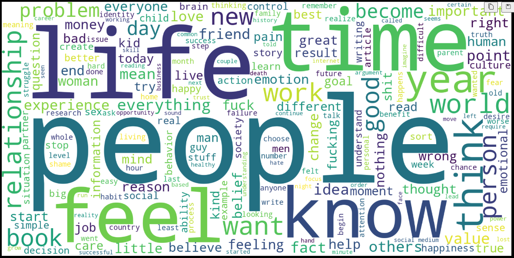

# Mark Manson Natural Language Processing

## Overview 
In this GitHub Repo I explore [Mark Manson's popular blog](https://markmanson.net/) by applying Explporatory Data Analysis and Natural Language Processing techniques. 

Below you can see an awesome Word Cloud that I generated using his blog posts. 

For the full analysis please feel free to check out the jupyter notebook here: [Mark Manson NLP Notebook](./main/analyze.ipynb). <-- Check it out!

